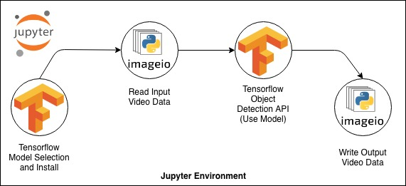

# vehicle-tracking-with-tensorflow

Bu Jupyter Notebook projesinde küçük çaplı bir araç izleme uygulaması oluşturulmuştur. Bu uygulama için çeşitli görüntü 
işleme araçlarından yardım alınmıştır. Temel olarak Tensorflow kütüphanesine ait hazırlanmış modellerden biri seçilmiş ve 
seçilen bu model kullanılarak çeşitli videolar içindeki araçların izlenmesi gerçekleştirilmiş ve izlenen araçların 
tipleri de tespit edilmiştir. Bu projede kullanılan hazır modele ve farklı olarak kullanılabilecek çeşitli modellere ve 
bu modeller ile ilgili  bilgilere [buradan](https://github.com/tensorflow/models/blob/master/research/object_detection/g3doc/detection_model_zoo.md) 
ulaşabilirsiniz.

Projenin akışı ise şu şekildedir:

Proje içerisindeki `input` klasöründen araç izleme de kullanılan videolara ulaşabilirsiniz. Aynı şekilde `output` klasörünün
altındada input olarak işlenen videoların çıktılarını görebilirsiniz.

Projeyi kullanabilmek için `Tensorflow Object Detection API`'yi yerel makineniz üzerine kurmanız gerekmektedir. Bunun için
[burada](https://tensorflow-object-detection-api-tutorial.readthedocs.io/en/latest/install.html) verilmiş olan adımları 
takip ederek kurulumunuzu gerçekleştirebilirsiniz.

