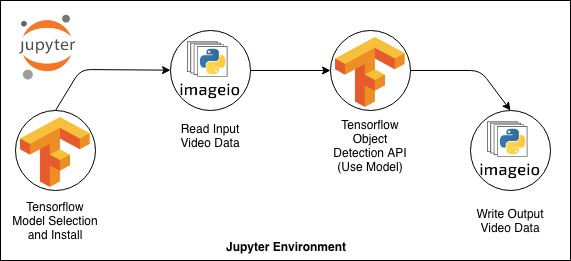

# vehicle-tracking-with-tensorflow

A small vehicle tracking application has been created in this Jupyter Notebook project. For this application, various 
image processing tools have been helped. Basically one of the prepared models belonging to the Tensorflow library was 
selected and selected using this model to monitor vehicles in various videos and types of vehicles watched has also been 
identified. To the ready-made model used in this project and various models that can be used differently, as well as 
information about these models [here](https://github.com/tensorflow/models/blob/master/research/object_detection/g3doc/detection_model_zoo.md). 

The flow of the project is as follows:

You can access videos that are used in vehicle tracking from the `input` folder in the project. Similarly, under the 
`output` folder you can see the output of videos processed as input. 

In order to use the project, you need to install `Tensorflow Object Detection API` on your local machine. You can 
perform your installation by following the steps given [here](https://tensorflow-object-detection-api-tutorial.readthedocs.io/en/latest/install.html).

